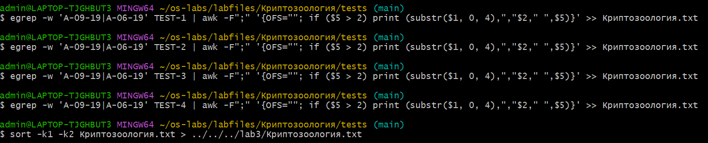
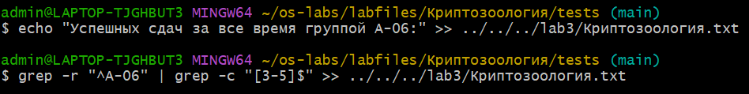
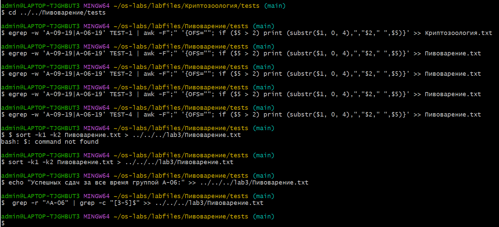
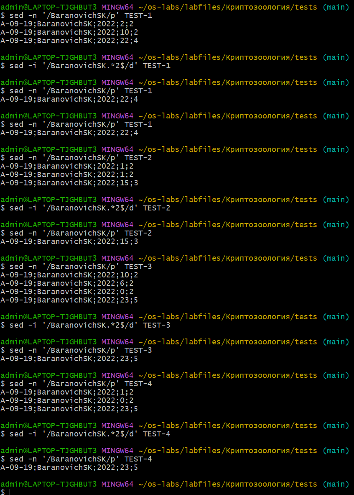
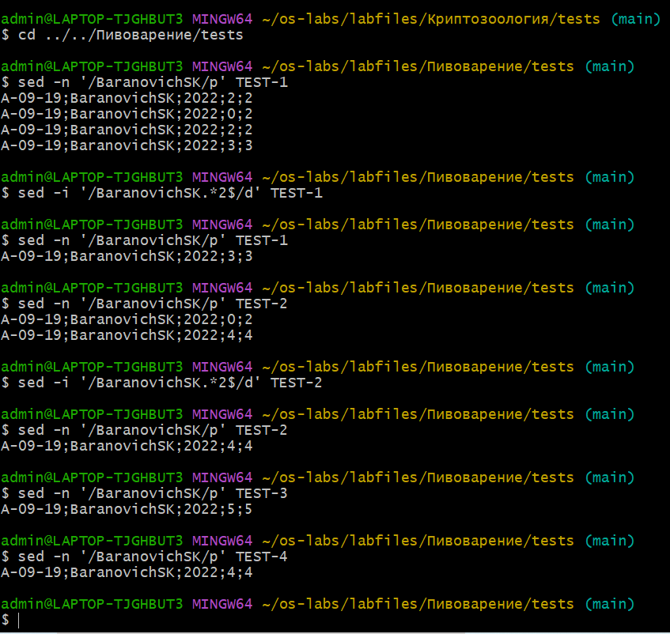
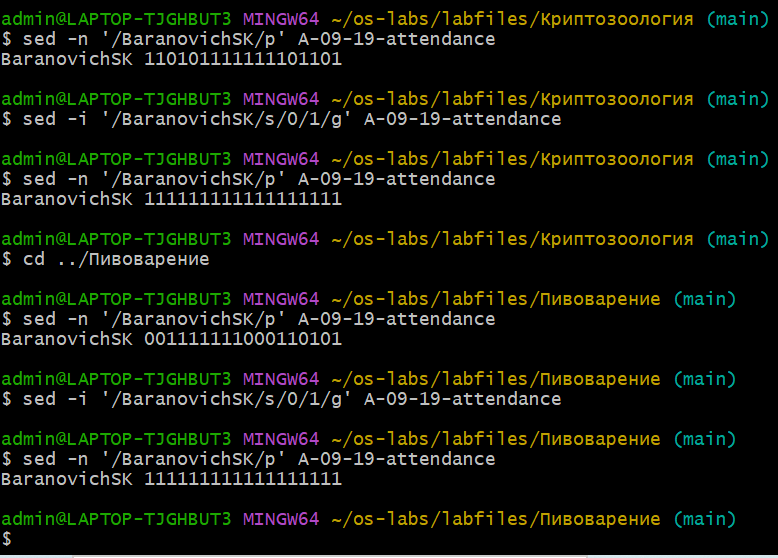
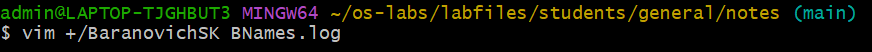
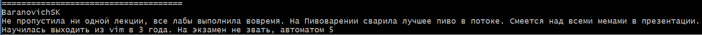

# Выполнение лабораторной работы 3
## Часть 1

## Часть 2
### Удаление неудачных попыток

 

За каждый тест была минимум одна удачная попытка, поэтому редактировать отчет и добавлять попытки в исходники не пришлось
### Редактирование пропусков

### Редактирование отзыва

